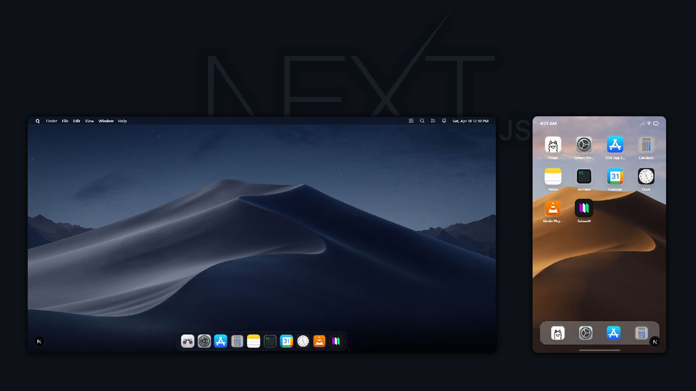
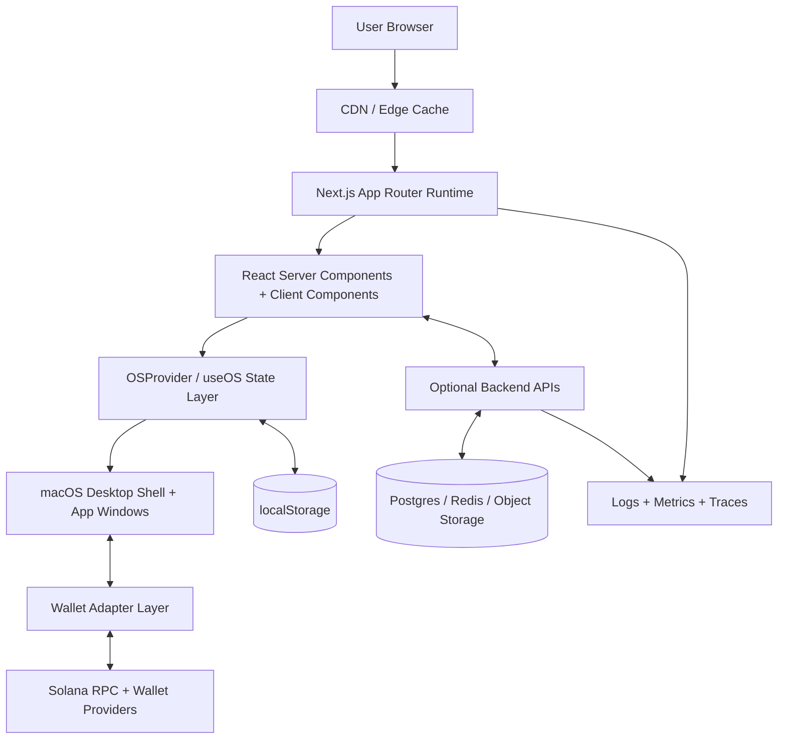

# QOS - Quantum Operating System

 


A web-based desktop operating system with an iOS-responsive interface for mobile and MacOS like interface for desktop and integrated Solana blockchain wallet connectivity. QOS brings a native OS experience to the web browser with full app management, window management, and decentralized identity.
 



## Table of Contents

- [Features](#features)
- [Quick Start](#quick-start)
- [Project Structure](#project-structure)
- [Architecture](#architecture)
- [Scaled Production Architecture](#scaled-production-architecture)
- [User Guide](#user-guide)
- [Extending QOS](#extending-qos)
- [Development Workflow](#development-workflow)
- [Building for Production](#building-for-production)
- [Troubleshooting](#troubleshooting)
- [Performance](#performance)
- [Security Considerations](#security-considerations)
- [Browser Support](#browser-support)
- [Contributing](#contributing)
- [Resources](#resources)
- [Support](#support)

## Features

- **Desktop Environment**: Fully functional window management system with draggable, resizable windows featuring macOS-style traffic lights
- **App Store**: Install and manage apps dynamically with install/uninstall functionality
- **12+ Built-in & Installable Apps**:
  - Always Installed: Finder, Settings, App Store, Safari
  - Installable: Calculator, Notes, Terminal, Weather, Photos, Music, Calendar, Maps, Clock
- **Solana Wallet Integration**: Connect with Phantom, Solflare, and other Solana wallets for Web3 identity
- **Responsive Design**: Automatic iOS-style interface on mobile devices with touch-optimized interactions
- **Glassmorphism UI**: Modern macOS Sonoma-inspired design with blur effects, rounded corners, and subtle shadows
- **Persistence**: localStorage-based app installation state that persists across sessions
- **Cross-Device Support**: Desktop (macOS-style), Tablet, and Mobile (iOS-style) optimized layouts

## Quick Start

### Installation

```bash
# Clone the repository
git clone https://github.com/alihd-tech/QOS
cd qos

# Install dependencies
npm install
# or
pnpm install

# Run development server
npm run dev
# or
pnpm dev
```

Open [http://localhost:3000](http://localhost:3000) in your browser.

### First Login

1. The app launches with a login screen featuring QOS branding
2. Click "Connect Wallet" to open the wallet selection modal
3. Choose between:
   - **Phantom Wallet** (extension/mobile)
   - **Solflare Wallet** (extension/mobile)
4. Approve the connection request in your wallet
5. Once connected, you'll enter the main QOS desktop environment

## Project Structure

Current high-level structure:

```
qos/
├── app/
│   ├── layout.tsx                # Root layout with Solana + theme providers
│   ├── page.tsx                  # Login orchestrator and OS bootstrap
│   ├── globals.css               # App-level globals and design tokens
│   └── favicon.ico
├── components/
│   ├── ui/                       # Reusable shadcn/ui primitives
│   ├── wallet/
│   │   ├── wallet-provider.tsx   # Solana wallet adapter configuration
│   │   └── login-screen.tsx      # Wallet-based login flow UI
│   └── macos/
│       ├── os-context.tsx        # Global OS state (apps, windows, focus)
│       ├── desktop.tsx           # Main desktop shell (responsive)
│       ├── menu-bar.tsx          # macOS-style top menu bar
│       ├── dock.tsx              # Dock with installed + running apps
│       ├── window.tsx            # Draggable/resizable window component
│       ├── app-icons.tsx         # App registry and metadata
│       ├── mobile-shell.tsx      # iOS-style mobile shell
│       ├── spotlight-overlay.tsx # Command/search overlay
│       ├── control-center-overlay.tsx
│       ├── notification-center-overlay.tsx
│       └── apps/
│           ├── finder-app.tsx
│           ├── safari-app.tsx
│           ├── calculator-app.tsx
│           ├── notes-app.tsx
│           ├── terminal-app.tsx
│           ├── appstore-app.tsx
│           ├── settings-app.tsx
│           ├── code-app.tsx
│           ├── solanam-app.tsx
│           ├── solearn-app.tsx
│           ├── qr-code-app.tsx
│           ├── news-app.tsx
│           ├── media-player-app.tsx
│           ├── weather-app.tsx
│           ├── photos-app.tsx
│           ├── music-app.tsx
│           ├── calendar-app.tsx
│           ├── maps-app.tsx
│           └── clock-app.tsx
├── hooks/
│   ├── use-device.ts             # Breakpoint/device type detection
│   ├── use-mobile.tsx            # Mobile behavior helper
│   └── use-toast.ts              # Toast state helper
├── lib/
│   ├── utils.ts                  # Shared utility helpers
│   ├── settings.ts               # User/system settings persistence
│   ├── wallpaper.ts              # Wallpaper management helpers
│   ├── sound.ts                  # Audio/feedback helpers
│   ├── theme.ts                  # Theme constants and utilities
│   └── device.ts                 # Device capability helpers
├── public/
│   └── wallpaper.jpg             # Default desktop wallpaper
├── docs/                         # Architecture and feature guides
├── styles/
│   └── globals.css               # Additional global style overrides
├── tailwind.config.ts            # Tailwind configuration
├── next.config.mjs               # Next.js runtime/build configuration
├── tsconfig.json                 # TypeScript configuration
└── package.json                  # Scripts and dependencies

```

> The `components/macos/apps/` and `components/ui/` folders include additional files not fully listed above.

## Architecture

### OS Context & State Management

The entire OS state is managed through `OSProvider` and `useOS()` hook:

```typescript
// Key state in os-context.tsx
- installedApps: string[]      // Array of installed app IDs
- openWindows: Window[]         // Currently open windows
- focusedWindow: string | null  // Which window has focus
- appCategories: Category[]     // App store categories
```

### Window Management

Windows are created and managed through the OS context:

```typescript
interface Window {
  id: string;
  appId: string;
  title: string;
  isMinimized: boolean;
  position: { x: number; y: number };
  size: { width: number; height: number };
  zIndex: number;
}
```

Windows support:
- Dragging (via mouse events)
- Resizing (from corners & edges)
- Minimizing/Maximizing/Closing (traffic light buttons)
- Focus management with z-index stacking
- Responsive sizing on mobile devices

### App System

Apps are registered in `app-icons.tsx` with metadata:

```typescript
interface AppConfig {
  id: string;
  name: string;
  category: 'system' | 'productivity' | 'utilities' | 'media' | 'entertainment';
  icon: React.ReactNode;
  isSystem: boolean;      // Cannot be uninstalled
  component: React.ReactNode;
  width: number;
  height: number;
  description: string;
}
```

### Responsive Behavior

The `use-device.ts` hook detects device type:

```typescript
- isMobile: boolean   // < 768px width
- isTablet: boolean   // 768px - 1024px width
- isDesktop: boolean  // > 1024px width
```

**Mobile:** Renders iOS-style shell in `mobile-shell.tsx`
**Desktop:** Renders full macOS environment with windows

### Advanced Architecture Diagram



### Scaled Production Architecture

For a scaled version (high traffic, multi-region users, enterprise-grade reliability), engineer QOS as follows:

- **Frontend runtime**: Deploy Next.js on edge-capable infrastructure with static asset caching and SSR/RSC optimization for fast first paint globally.
- **State strategy**: Keep ephemeral UI state local in React Context, move durable cross-device state (installed apps, user prefs, layouts) to backend APIs with local caching fallback.
- **API tier**: Introduce typed API boundaries (REST or tRPC) behind an API gateway, with rate limits, auth middleware, and versioned contracts.
- **Data layer**: Use Postgres for relational user/app metadata, Redis for hot session/cache data, and object storage for media or larger app payloads.
- **Async workloads**: Offload notifications, indexing, analytics, and sync jobs to queue workers (for example BullMQ or managed queues).
- **Web3 reliability**: Add RPC failover across multiple Solana providers, request batching, retry/backoff policies, and connection health scoring.
- **Observability**: Instrument OpenTelemetry traces, structured logs, frontend error monitoring, and SLO dashboards (latency, error rate, wallet-connect success rate).
- **Security hardening**: Apply CSP, strict input validation, per-route authZ, secret management, and dependency/container scanning in CI.
- **Delivery model**: Use blue/green or canary deploys, feature flags, and schema migration pipelines with rollback safety.
- **Scale topology**: Run multi-region active-passive first, then active-active for low-latency global users when conflict handling and data replication maturity is ready.

At scale, the target shape is: **Edge-rendered UI + centralized policy/auth + distributed data/cache + resilient Web3 connectivity + full observability**.

## User Guide

### Installing Apps

1. Open the App Store (dock icon or desktop)
2. Browse available apps by category
3. Click "Get" or view details
4. Click "Install" in the app detail modal
5. The app appears in your dock immediately

### Opening Apps

**Desktop**: Click the app icon in the dock or double-click on desktop
**Mobile**: Tap the app in the bottom tab bar

### Managing Windows

- **Drag**: Click and drag the window title bar
- **Resize**: Drag from any edge or corner
- **Close**: Click red traffic light (top-left)
- **Minimize**: Click yellow traffic light
- **Maximize**: Click green traffic light
- **Focus**: Click anywhere on the window to bring to front

### Uninstalling Apps

1. In App Store, find the installed app
2. Click "Uninstall" button (only available for non-system apps)
3. The app is removed from dock and installed list

### Wallet Management

- Connected wallet address displays in top-right of menu bar
- Click the address to see wallet balance and settings
- Disconnect by clicking "Disconnect" in the wallet menu

## Extending QOS

### Creating a New App

See [EXTENDING.md](./docs/EXTENDING.md) for detailed instructions.

Quick example:

```typescript
// components/macos/apps/my-app.tsx
import { WindowComponent } from '@/components/macos/window';

export function MyApp() {
  return (
    <WindowComponent 
      title="My App" 
      appId="myapp"
      icon={<YourIcon />}
    >
      {/* Your app content */}
    </WindowComponent>
  );
}
```

Then register in `app-icons.tsx`:

```typescript
{
  id: 'myapp',
  name: 'My App',
  category: 'utilities',
  icon: <YourIcon />,
  isSystem: false,
  component: <MyApp />,
  width: 600,
  height: 400,
  description: 'Description of my app',
}
```

### Customizing the Theme

Edit `app/globals.css` to modify design tokens:

```css
:root {
  --primary: 211 100% 50%;        /* Primary brand color */
  --background: 220 14% 96%;      /* Background color */
  --foreground: 220 9% 12%;       /* Text color */
  --window-bg: 0 0% 100% / 0.85;  /* Window background opacity */
  --dock-bg: 0 0% 100% / 0.45;    /* Dock background opacity */
}
```

### Adding Wallet Providers

Edit `components/wallet/wallet-provider.tsx` to add new chains or wallets:

```typescript
const wallets = [
  new PhantomWalletAdapter(),
  new SolflareWalletAdapter(),
  // Add more wallets here
];
```

## Development Workflow

### Tech Stack

- **Framework**: Next.js 16 (App Router)
- **Styling**: Tailwind CSS + Custom CSS
- **State Management**: React Context API
- **Blockchain**: Solana Web3.js + Wallet Adapter
- **Language**: TypeScript
- **Font**: SF Pro Display (system font stack)

### Key Hooks

```typescript
// Get OS state & methods
const os = useOS();

// Detect device type
const { isMobile, isTablet, isDesktop } = useDevice();

// Solana wallet connection
const { publicKey, connected, connect, disconnect } = useWallet();
const { connection } = useConnection();
```

### Styling Guidelines

- Use Tailwind CSS utilities for layout and spacing
- Follow macOS design with `glass` and `glass-light` classes
- Use CSS custom properties for theming
- Responsive prefixes: `md:`, `lg:` for breakpoints
- Mobile-first approach in styles

### Common Patterns

**Creating a modal/overlay**:
```typescript
<div className="fixed inset-0 bg-black/40 glass flex items-center justify-center z-50">
  {/* Modal content */}
</div>
```

**Responsive layout**:
```typescript
<div className="grid grid-cols-1 md:grid-cols-2 lg:grid-cols-3 gap-4">
  {/* Content */}
</div>
```

**Window component**:
```typescript
<WindowComponent
  title="App Name"
  appId="appid"
  icon={<IconComponent />}
  width={640}
  height={480}
>
  {/* App content */}
</WindowComponent>
```

## Building for Production

```bash
# Build the application
npm run build

# Start production server
npm start
```

### Deployment

QOS is optimized for Vercel deployment:

```bash
# Deploy to Vercel
vercel deploy
```

Set environment variables in Vercel dashboard if needed (currently uses wallet adapters without requiring API keys).

## Troubleshooting

### Wallet Connection Issues

- **Phantom not detected**: Ensure Phantom extension is installed and enabled
- **Connection refused**: Check wallet is unlocked and permissions granted
- **Mobile wallet**: Use deep linking - click wallet name will open mobile app

### App Not Appearing

- Check if app is registered in `app-icons.tsx`
- Verify app component exists in `components/macos/apps/`
- Check browser console for errors
- Clear localStorage: `localStorage.clear()`

### Responsive Issues

- Check `use-device.ts` for correct breakpoints
- Test using browser DevTools device emulation
- Verify `mobile-shell.tsx` rendering for mobile devices
- Check `globals.css` for mobile-specific styles

### Window Dragging Not Working

- Ensure window is in focused z-index
- Check that dragging isn't blocked by child element `pointer-events`
- Verify mouse event handlers are attached to window component

## Performance

- Apps are code-split and lazy-loaded
- Images use next/image for optimization
- Glassmorphism uses GPU-accelerated backdrop-filter
- Minimal re-renders through context and memo optimization
- localStorage for instant app state restoration

## Security Considerations

- **Wallet Keys**: Never stored locally - only address displayed
- **Window State**: Public data only, no sensitive info stored
- **CORS**: Solana RPC is public, no backend needed
- **XSS Protection**: All user input sanitized in apps

## Browser Support

- Chrome/Edge 90+
- Firefox 88+
- Safari 15+
- Mobile Safari 15+ (iOS 15+)
- Samsung Internet 14+

## Contributing

See [CONTRIBUTING.md](./docs/CONTRIBUTING.md) for guidelines.

## License

MIT - See LICENSE file

## Resources

- [QOS Architecture](./docs/ARCHITECTURE.md)
- [Extending QOS](./docs/EXTENDING.md)
- [Mobile & Responsive Design](./docs/MOBILE_RESPONSIVE.md)
- [Wallet Integration Guide](./docs/WALLET_INTEGRATION.md)
- [App Development Guide](./docs/APP_DEVELOPMENT.md)
- [Solana Docs](https://docs.solana.com)
- [Wallet Adapter GitHub](https://github.com/solana-labs/wallet-adapter)